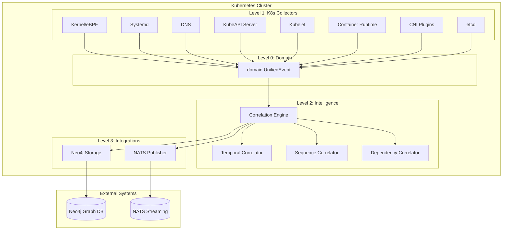

# Tapio - Observability Correlation Platform

Tapio is a correlation engine for observability data. It collects system events from multiple sources, identifies relationships between them, and stores correlations in Neo4j for graph-based analysis.

## What It Actually Does

**Core Mission: Kubernetes Observability Intelligence**
- Provides complete visibility into Kubernetes cluster behavior and dependencies
- Correlates events across all layers: kernel, container runtime, kubelet, API server
- Identifies root causes of failures through cross-component event analysis
- Maps service dependencies and resource relationships automatically

**Event Collection:**
- Collects kernel events via eBPF (process, network, file operations)
- Monitors Kubernetes API server events (pods, services, deployments)
- Tracks container runtime operations (CRI-O, containerd)
- Monitors kubelet and CNI plugin activities
- Captures DNS queries, etcd operations, and systemd services
- Correlates events to find patterns and dependencies
- Stores correlation results in Neo4j graph database
- Streams events through NATS

## Architecture Flow



## Architecture Rules

**5-Level Hierarchy (STRICTLY ENFORCED):**
```
Level 0: pkg/domain/          # Zero dependencies
Level 1: pkg/collectors/      # Domain only  
Level 2: pkg/intelligence/    # Domain + L1
Level 3: pkg/integrations/    # Domain + L1 + L2
Level 4: pkg/interfaces/      # All above
```

Components can ONLY import from lower levels. No exceptions.

## Implemented Components

### Collectors (All Available)
- **kernel**: eBPF programs for syscall monitoring (process exec, network, file ops)
- **systemd**: Journal reader for service events  
- **dns**: eBPF-based DNS query/response capture
- **kubeapi**: Kubernetes API server event monitoring (pods, services, deployments, network policies)
- **kubelet**: Node-level container lifecycle and resource monitoring
- **cri**: Container runtime interface monitoring (containerd, CRI-O operations)
- **cni**: Container network interface plugin event tracking
- **etcd**: Kubernetes datastore operation monitoring

### Correlation Engine
Processes events and finds relationships:
- **Temporal**: Events occurring in time patterns
- **Sequence**: Event chains (A→B→C patterns)
- **Dependency**: Service/pod dependencies (requires Neo4j)

### Storage
- **Neo4j**: Stores correlations as graph relationships
- **Memory**: In-memory correlation cache

## Building

```bash
# Prerequisites
# - Go 1.21+
# - Linux kernel 4.14+ (for eBPF)
# - clang/llvm (for eBPF compilation)

# Build everything
make build

# Format code (MANDATORY before commit)
make fmt

# Run tests
make test

# Generate eBPF programs
make bpf-generate
```

## Configuration

```yaml
# config/tapio.yaml
collectors:
  kernel:
    enabled: true
    buffer_size: 8192
  systemd:
    enabled: true
    unit_filter: ["*.service"]
  dns:
    enabled: true

correlation:
  engine:
    worker_count: 4
    event_buffer_size: 1000
  
integrations:
  neo4j:
    uri: "bolt://localhost:7687"
    username: "neo4j"
    password: "password"
  nats:
    url: "nats://localhost:4222"
    stream: "events"
```

## Running

```bash
# Start with default config
./bin/tapio

# With custom config
./bin/tapio -config config/tapio.yaml

# Collectors only mode
./bin/tapio -mode collectors

# Correlation only mode  
./bin/tapio -mode correlation
```

## Example Correlations It Can Find

### 1. Service Restart Cascade
When systemd restarts a service, the correlation engine can identify:
- Related pod terminations
- Dependent service impacts
- Configuration changes that triggered it

### 2. Memory Pressure Events
Kernel OOM killer events are correlated with:
- Process memory allocations
- Container memory limits
- Service degradation

### 3. DNS Resolution Failures
DNS failures are correlated with:
- Service connection errors
- Pod networking issues
- Network policy changes

## Development Standards

From `CLAUDE.md` - these are enforced:
- **80% test coverage minimum**
- **No stubs, no TODOs** - only working code
- **Must compile**: `go build ./...` must pass
- **Must format**: `make fmt` before any commit
- **No `map[string]interface{}`** in public APIs
- **Follow 5-level architecture** - no exceptions

## Current Limitations

- Graph correlations require Neo4j to be running
- eBPF collectors require root/CAP_BPF privileges
- Only works on Linux (eBPF dependency)
- Kubernetes collectors require appropriate cluster RBAC permissions

## Project Status

This is an active correlation engine with working eBPF collectors and basic correlation capabilities. The architecture is solid and enforced. More collectors and correlators can be added following the established patterns.

## License

Apache 2.0
