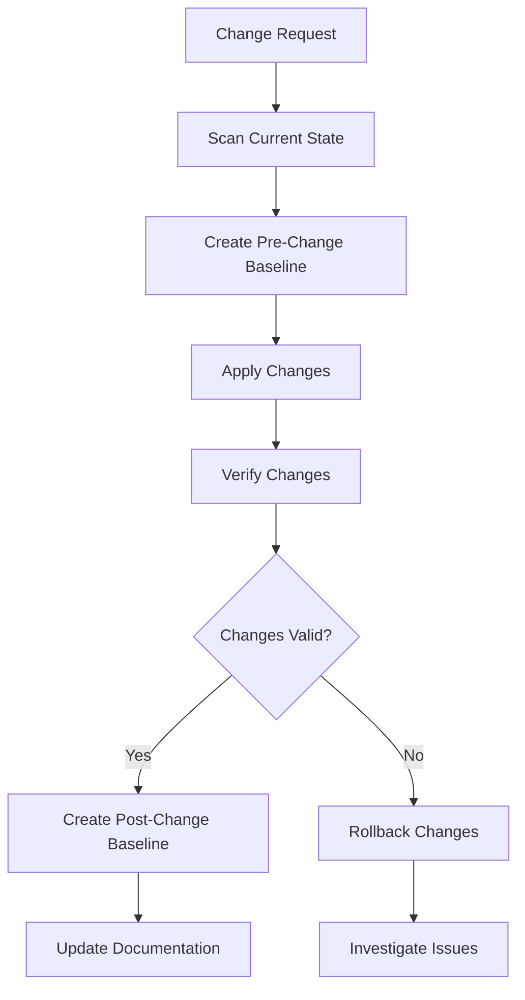

# Best Practices Guide

Essential guidelines for using VAINO effectively in production environments.

## 🏗️ Infrastructure Management

### Baseline Strategy

**Establish Clear Baseline Policies:**
```bash
# Create baselines after approved changes
terraform apply
wgo scan --provider terraform
wgo baseline create --name "prod-v$(date +%Y%m%d)" \
  --description "Production deployment $(date +%Y-%m-%d)" \
  --tags "environment=prod,approved=true"

# Keep baseline history (retain last 3-5 baselines)
wgo baseline list --tags "environment=prod" --sort date | tail -n +6 | \
  xargs -I {} wgo baseline delete {}
```

**Environment-Specific Baselines:**
```bash
# Separate baselines per environment
wgo baseline create --name "prod-baseline"
wgo baseline create --name "staging-baseline" 
wgo baseline create --name "dev-baseline"

# Tag for easy management
wgo baseline create --name "$(git rev-parse --short HEAD)" \
  --tags "git-hash=$(git rev-parse HEAD),environment=prod"
```

### Change Detection Frequency

**Production Environments:**
- **Critical systems**: Every 5-15 minutes
- **Standard systems**: Every 30-60 minutes
- **Development**: Every 2-4 hours

**Implementation:**
```bash
# High-frequency monitoring for critical infrastructure
*/5 * * * * /usr/local/bin/wgo scan --provider terraform --quiet && \
  /usr/local/bin/wgo diff --baseline prod-baseline --severity high --quiet || \
  /usr/local/bin/alert-team "Critical infrastructure drift detected"

# Standard monitoring
0 */1 * * * /home/ops/scripts/infrastructure-check.sh
```

## 🔒 Security & Compliance

### Authentication Best Practices

**Use Service Accounts:**
```yaml
# ~/.vaino/config.yaml
providers:
  aws:
    # Use IAM roles instead of access keys
    role_arn: "arn:aws:iam::123456789012:role/VAINOMonitoringRole"
    
  gcp:
    # Use service account with minimal permissions
    service_account_file: "/etc/wgo/gcp-service-account.json"
    
  kubernetes:
    # Use service account tokens
    service_account_token_file: "/var/run/secrets/kubernetes.io/serviceaccount/token"
```

**Least Privilege Access:**
```json
{
  "Version": "2012-10-17",
  "Statement": [
    {
      "Effect": "Allow",
      "Action": [
        "ec2:Describe*",
        "s3:GetBucketLocation",
        "s3:ListBucket",
        "rds:Describe*"
      ],
      "Resource": "*"
    }
  ]
}
```

### Sensitive Data Handling

**Never Log Secrets:**
```bash
# Good: Filter sensitive data from logs
wgo scan --format json | jq 'del(.resources[].secrets)' > scan-results.json

# Bad: Don't include secrets in outputs
wgo scan --include-secrets --format json > public-log.json
```

**Secure Configuration:**
```yaml
# ~/.vaino/config.yaml
storage:
  encryption: true
  key_file: "/etc/wgo/encryption.key"

output:
  # Redact sensitive fields
  redact_patterns:
    - "password"
    - "secret"
    - "token"
    - "key"
```

## 🚀 Performance Optimization

### Resource Scanning Efficiency

**Provider-Specific Optimization:**
```yaml
# ~/.vaino/config.yaml
providers:
  aws:
    # Scan only critical regions
    regions: ["us-east-1", "us-west-2"]
    
    # Focus on important services
    include_services: ["ec2", "rds", "s3", "lambda"]
    
    # Skip noisy resources
    exclude_resources: ["aws_cloudwatch_log_group", "aws_cloudformation_stack"]
    
  kubernetes:
    # Monitor specific namespaces
    namespaces: ["production", "monitoring", "security"]
    
    # Exclude system noise
    exclude_resources: ["Event", "Endpoints", "EndpointSlice"]

# Cache settings for performance
cache:
  enabled: true
  ttl: 300s  # 5 minutes
  max_size: 100MB
```

**Parallel Scanning:**
```bash
# Scan providers in parallel
wgo scan --provider aws &
wgo scan --provider gcp &
wgo scan --provider kubernetes &
wait

# Process results
wgo diff --all --format json > combined-drift-report.json
```

### Storage Management

**Automated Cleanup:**
```bash
#!/bin/bash
# cleanup-snapshots.sh

# Keep snapshots for 30 days
find ~/.wgo/snapshots -name "*.json" -mtime +30 -delete

# Keep only last 10 baselines per environment
for env in prod staging dev; do
  wgo baseline list --tags "environment=$env" --sort date | \
    tail -n +11 | xargs -I {} wgo baseline delete {}
done

# Compress old logs
find ~/.wgo/logs -name "*.log" -mtime +7 -exec gzip {} \;
```

## 📊 Monitoring & Alerting

### Alert Prioritization

**Severity-Based Alerting:**
```bash
# Critical: Immediate notification
wgo diff --severity critical --quiet || \
  curl -X POST "$PAGERDUTY_WEBHOOK" \
    -d '{"severity":"critical","message":"Critical infrastructure drift"}'

# High: Team notification
wgo diff --severity high --quiet || \
  curl -X POST "$SLACK_WEBHOOK" \
    -d '{"text":"🚨 High-severity infrastructure changes detected"}'

# Medium/Low: Daily digest
wgo diff --severity medium,low --format markdown >> daily-changes.md
```

**Resource-Specific Alerts:**
```bash
# Security-sensitive resources
wgo diff --resource-type "SecurityGroup,IAMRole,Secret" --quiet || \
  alert-security-team "Security resource changes detected"

# Cost-impacting resources  
wgo diff --resource-type "Instance,Database" --quiet || \
  alert-finance-team "Cost-impacting changes detected"
```

### Correlation Analysis

**Event Correlation:**
```bash
#!/bin/bash
# correlate-changes.sh

# Capture deployment events
kubectl get events --field-selector type=Normal | grep -i deploy > recent-deployments.log

# Scan for changes
wgo scan --provider kubernetes --quiet
if ! wgo diff --quiet; then
  # Correlate changes with deployment events
  echo "Infrastructure changes detected. Recent deployments:"
  cat recent-deployments.log
  
  # Check for planned changes
  if grep -q "$(date +%Y-%m-%d)" planned-changes.txt; then
    echo "✅ Changes match planned deployment"
  else
    echo "⚠️ Unplanned changes detected - investigating"
    alert-ops-team "Unplanned infrastructure changes"
  fi
fi
```

## 🔄 CI/CD Integration

### Pre-Deployment Checks

**Infrastructure Validation:**
```yaml
# .github/workflows/pre-deploy.yml
name: Pre-Deployment Infrastructure Check

on:
  pull_request:
    paths: ['infrastructure/**']

jobs:
  infrastructure-check:
    runs-on: ubuntu-latest
    steps:
      - uses: actions/checkout@v3
      
      - name: Install VAINO
        run: curl -sSL https://install.wgo.sh | bash
        
      - name: Scan current infrastructure
        run: wgo scan --provider terraform --quiet
        
      - name: Check for unexpected drift
        run: |
          if ! wgo diff --baseline production-baseline --severity high --quiet; then
            echo "❌ Unexpected high-severity drift detected"
            echo "Please resolve before deploying new changes"
            exit 1
          fi
          
      - name: Validate Terraform plan
        run: |
          terraform plan -out=plan.tfplan
          terraform show -json plan.tfplan > plan.json
          
      - name: Estimate impact
        run: |
          # Custom script to analyze plan impact
          python scripts/analyze-plan-impact.py plan.json
```

**Post-Deployment Verification:**
```bash
#!/bin/bash
# post-deploy-verification.sh

echo "🔍 Post-deployment infrastructure verification"

# Wait for deployment to stabilize
sleep 30

# Scan new state
wgo scan --provider terraform --snapshot-name "post-deploy-$(date +%Y%m%d-%H%M)"

# Compare with pre-deployment snapshot
PRE_DEPLOY_SNAPSHOT=$(wgo scan list --tags "pre-deploy" --sort date | tail -1)
wgo diff "$PRE_DEPLOY_SNAPSHOT" current --format json > deployment-changes.json

# Validate expected changes
if python scripts/validate-deployment-changes.py deployment-changes.json; then
  echo "✅ Deployment changes validated"
  
  # Create new baseline
  wgo baseline create --name "post-deploy-$(date +%Y%m%d)" \
    --description "State after deployment $(git rev-parse --short HEAD)"
else
  echo "❌ Unexpected deployment changes detected"
  exit 1
fi
```

### Rollback Procedures

**Automated Rollback Detection:**
```bash
#!/bin/bash
# rollback-detection.sh

# Detect rollback scenario
if git log --oneline -1 | grep -i "revert\|rollback"; then
  echo "🔄 Rollback deployment detected"
  
  # Find baseline before problematic deployment
  LAST_GOOD_BASELINE=$(wgo baseline list --tags "verified=true" --sort date | tail -1)
  
  # Compare current state with last good baseline
  wgo diff --baseline "$LAST_GOOD_BASELINE" --format json > rollback-validation.json
  
  # Verify rollback completed successfully
  if python scripts/validate-rollback.py rollback-validation.json; then
    echo "✅ Rollback validation successful"
    wgo baseline create --name "rollback-$(date +%Y%m%d)" \
      --tags "rollback=true,verified=true"
  else
    echo "❌ Rollback validation failed - manual intervention required"
    alert-ops-team "Rollback validation failed"
  fi
fi
```

## 📈 Operational Excellence

### Regular Maintenance

**Weekly Maintenance Tasks:**
```bash
#!/bin/bash
# weekly-maintenance.sh

echo "🔧 Weekly VAINO maintenance"

# Update baselines after maintenance windows
if [ "$(date +%u)" -eq 7 ]; then  # Sunday
  echo "Creating weekly baseline..."
  wgo scan --all --snapshot-name "weekly-$(date +%Y%m%d)"
  wgo baseline create --name "weekly-$(date +%Y%m%d)" \
    --description "Weekly maintenance baseline"
fi

# Cleanup old data
bash cleanup-snapshots.sh

# Validate configuration
wgo check-config --verbose

# Update provider credentials if needed
check-credential-expiry.sh

# Generate weekly report
wgo diff --from "7 days ago" --format markdown > reports/weekly-$(date +%Y%m%d).md
```

### Capacity Planning

**Resource Growth Tracking:**
```bash
#!/bin/bash
# resource-growth-tracking.sh

# Track resource counts over time
RESOURCE_COUNT=$(wgo scan --format json | jq '.metadata.resource_count')
echo "$(date +%Y-%m-%d),$RESOURCE_COUNT" >> resource-growth.csv

# Analyze growth trends
if [ -f resource-growth.csv ]; then
  python scripts/analyze-growth-trends.py resource-growth.csv > capacity-report.txt
  
  # Alert if growth exceeds thresholds
  if grep -q "WARNING" capacity-report.txt; then
    alert-capacity-team "Resource growth threshold exceeded"
  fi
fi
```

### Documentation Maintenance

**Automated Documentation Updates:**
```bash
#!/bin/bash
# update-docs.sh

# Generate current infrastructure inventory
wgo scan --all --format markdown > docs/current-infrastructure.md

# Update baseline documentation
wgo baseline list --format markdown > docs/baselines.md

# Generate provider configuration docs
wgo status --verbose --format markdown > docs/provider-status.md

# Create drift history report
wgo diff --from "30 days ago" --format markdown > docs/drift-history.md

# Commit documentation updates
git add docs/
git commit -m "docs: Update infrastructure documentation [skip ci]"
```

## 🎯 Team Workflows

### Change Management Process

**Change Request Workflow:**


**Implementation:**
```bash
# change-management.sh
CHANGE_ID="$1"
DESCRIPTION="$2"

# 1. Scan current state
wgo scan --snapshot-name "pre-change-$CHANGE_ID"

# 2. Create baseline
wgo baseline create --name "pre-change-$CHANGE_ID" \
  --description "$DESCRIPTION" \
  --tags "change-id=$CHANGE_ID,stage=pre"

# 3. Execute change (manual or automated)
echo "Ready for change execution. Press enter after changes are complete..."
read

# 4. Verify changes
wgo scan --snapshot-name "post-change-$CHANGE_ID"
wgo diff "pre-change-$CHANGE_ID" "post-change-$CHANGE_ID" --format markdown > "change-$CHANGE_ID-report.md"

# 5. Validate and approve
echo "Review change-$CHANGE_ID-report.md and approve if valid (y/n):"
read approval

if [ "$approval" = "y" ]; then
  wgo baseline create --name "post-change-$CHANGE_ID" \
    --description "Approved change: $DESCRIPTION" \
    --tags "change-id=$CHANGE_ID,stage=post,approved=true"
  echo "✅ Change approved and baseline created"
else
  echo "❌ Change not approved - consider rollback"
fi
```

### Team Responsibilities

**Role-Based Access:**
```yaml
# ~/.wgo/rbac.yaml
roles:
  operators:
    permissions:
      - scan
      - diff
      - baseline:create
      - baseline:list
    providers: ["terraform", "kubernetes"]
    
  developers:
    permissions:
      - scan
      - diff
    providers: ["terraform"]
    
  security:
    permissions:
      - scan
      - diff
      - baseline:create
      - baseline:delete
    resource_types: ["SecurityGroup", "IAMRole", "Secret"]
```

## 🚨 Incident Response

### Drift Detection During Incidents

**Emergency Procedures:**
```bash
#!/bin/bash
# emergency-drift-check.sh

INCIDENT_ID="$1"

echo "🚨 Emergency infrastructure check for incident $INCIDENT_ID"

# Take immediate snapshot
wgo scan --all --snapshot-name "incident-$INCIDENT_ID-$(date +%Y%m%d-%H%M)"

# Compare with last known good state
LAST_BASELINE=$(wgo baseline list --tags "verified=true" --sort date | tail -1)
wgo diff --baseline "$LAST_BASELINE" --severity high,critical --format json > "incident-$INCIDENT_ID-drift.json"

# Quick analysis
if [ -s "incident-$INCIDENT_ID-drift.json" ]; then
  echo "⚠️ Infrastructure drift detected during incident"
  
  # Extract critical changes
  jq '.changes[] | select(.severity == "critical")' "incident-$INCIDENT_ID-drift.json" > critical-changes.json
  
  # Alert incident commander
  curl -X POST "$INCIDENT_WEBHOOK" \
    -d "{\"incident_id\":\"$INCIDENT_ID\",\"infrastructure_drift\":true}"
    
  # Generate immediate report
  wgo explain --format markdown > "incident-$INCIDENT_ID-analysis.md"
else
  echo "✅ No infrastructure drift detected"
fi
```

This comprehensive best practices guide ensures teams can use VAINO effectively while maintaining security, performance, and operational excellence.